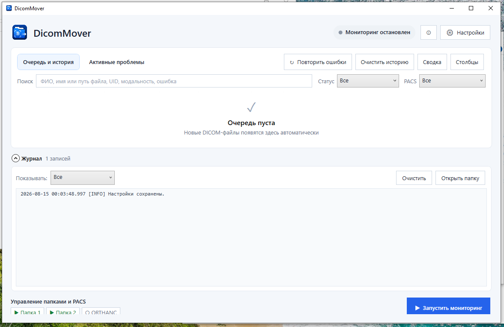

# DicomMover


DicomMover находит DICOM-файлы в локальных папках и доступных сетевых ресурсах Windows и отправляет их на один или несколько PACS по DICOM C-STORE.

Очередь сохраняется между запусками программы. Если PACS временно недоступен, DicomMover продолжает проверять соединение и возобновляет отправку после его восстановления.

## Пользователю

### Скачать

- [DicomMover 1.5 для Windows x64 — EXE](https://github.com/Eskimossss/DicomMover/releases/download/1.5/DicomMover-1.5-win-x64.exe) — самодостаточная single-file portable-сборка.
- [Все версии и контрольные суммы](https://github.com/Eskimossss/DicomMover/releases).

Portable-сборка предназначена для Windows 10/11 и Windows Server x64 с графической оболочкой Desktop Experience. Установка .NET Desktop Runtime не требуется.

### Интерфейс



В главном окне отображаются очередь и история доставки, активные проблемы, журнал и состояние каждой папки и PACS. Для поиска доступны имя и путь файла, ФИО пациента, UID, модальность и текст ошибки. Записи можно фильтровать по статусу и PACS, а высоту журнала можно менять мышью.

### Быстрый старт

1. Откройте **Настройки → PACS** и добавьте принимающий сервер.
2. Укажите IP-адрес, порт и Called AE. Поле Calling AE по умолчанию заполняется значением `DICOMMOVER`.
3. Нажмите **Проверить C-ECHO**, чтобы проверить соединение с PACS.
4. Откройте **Настройки → Папки**, добавьте папку с DICOM-файлами и выберите PACS назначения.
5. При необходимости настройте поиск в подпапках, ограничение по Study Date и действие с файлом после успешной отправки.
6. Если старое оборудование записывает кириллицу с неверным или пустым Specific Character Set, откройте **Настройки → Кодировка**, выполните диагностику и проверьте преобразование перед включением правила.
7. Сохраните настройки и нажмите **Запустить мониторинг**.

До добавления хотя бы одной папки и одного PACS запуск мониторинга будет недоступен.

### Основные возможности

- несколько наблюдаемых папок и несколько PACS;
- отдельный выбор PACS назначения для каждой папки;
- поиск DICOM-файлов во вложенных папках;
- отбор файлов по Study Date `(0008,0020)`;
- проверка PACS через C-ECHO и отправка через C-STORE;
- постоянная очередь с восстановлением после перезапуска;
- независимый результат доставки на каждый PACS;
- защита от повторной отправки по SOP Instance UID `(0008,0018)`;
- автоматические и ручные повторные отправки;
- отправка сохранённых исследований на новый или дополнительный PACS без повторной доставки на остальные серверы;
- отдельный список активных проблем с полным текстом ошибки и рекомендуемыми действиями;
- сводка отправки за выбранную дату или диапазон дат с фильтром и результатами по конкретному PACS;
- независимый настраиваемый интервал проверки доступности PACS;
- диагностика DICOM-текста и управляемые правила перекодировки для конкретной пары «папка → PACS»;
- разовое решение неоднозначной кодировки с сохранением до успешного C-STORE;
- условия правил по Modality, Station Name и Manufacturer для папок с файлами от разных аппаратов;
- безопасное преобразование CP1251-совместимого текста в ISO_IR 144 или ISO_IR 192 без изменения исходного DICOM;
- остановка преобразования, если целевая кодировка не может представить текст без потерь;
- запрет полностью одинаковых PACS по адресу, порту и Called AE Title;
- настраиваемая задержка удаления пустых подпапок;
- сохранение, удаление или архивирование исходных файлов;
- поиск, фильтры, настраиваемые столбцы и подробности DICOM-экземпляра;
- ежедневные журналы и резервные копии базы;
- автозапуск вместе с Windows и работа в системном трее;
- защита от одновременного запуска двух экземпляров программы.

### Если PACS недоступен

При ручном запуске мониторинга DicomMover проверяет доступность включённых папок, базы SQLite и PACS. Если C-ECHO не выполнен, в отчёте будет указан проблемный PACS. После этого можно отменить запуск или продолжить работу с недоступным сервером.

Интервал C-ECHO задаётся отдельно в **Настройки → Мониторинг** и не зависит от интервала сканирования папок. Первая проверка выполняется сразу после запуска мониторинга.

Если PACS недоступен во время работы:

- доставка конкретного DICOM-файла на этот PACS остаётся в очереди;
- проверка соединения повторяется через настроенный интервал;
- счётчик попыток C-STORE не увеличивается;
- после восстановления связи отправка продолжается автоматически.

Если соединение установлено, но C-STORE завершается ошибкой, повторы выполняются через 1, 5, 15 и 30 минут. После пятой ошибки автоматические повторы прекращаются. Доставку можно вернуть в очередь вручную кнопкой **Повторить ошибки** или через подробности выбранного файла.

### Работа с исходными файлами

После успешной доставки файла на все назначенные PACS программа может:

- оставить файл в исходной папке;
- удалить файл;
- перенести файл в архив.

Для архива можно сохранить исходную структуру подпапок. В режимах удаления и архивирования доступна очистка опустевших вложенных папок с задержкой от 5 до 1440 минут; корневая наблюдаемая папка и каталог `BAD` не удаляются. Поле задержки недоступно, пока очистка выключена.

Временно недоступный, заблокированный или изменяющийся файл остаётся на месте для следующего цикла. Файл, подтверждённый как повреждённый в трёх последовательных стабильных циклах, переносится в папку `BAD` внутри соответствующей наблюдаемой папки. Ошибка доступа к одной подпапке не останавливает обход остальных каталогов.

Перед использованием автоматического удаления рекомендуется проверить конфигурацию и отправку на тестовых данных.

### Очередь и защита от повторной отправки

Для каждого DICOM-файла хранится отдельный результат доставки на каждый PACS. Незавершённые доставки остаются в очереди после перезапуска программы.

После успешной отправки SOP Instance UID записывается в отдельный реестр. Поэтому очистка старой подробной истории не приводит к повторной отправке уже доставленного DICOM-экземпляра.

Команда **Очистить историю** скрывает выбранные записи из главного окна. Она не удаляет исходные DICOM-файлы.

### Журнал и персональные данные

Журнал открывается в нижней части главного окна. Записи можно отфильтровать по уровням **Ошибки**, **Предупреждения** и **Информация**.

Если журнал закрыт и появляется новое предупреждение или ошибка, рядом с его заголовком отображается метка **Новая проблема**. Кнопка **Очистить** очищает только видимую область; файл журнала остаётся на диске.

Для стабильной работы интерфейс хранит не более 2 000 последних строк журнала; полный журнал продолжает записываться в файл.

Запись ФИО пациента в файлы журнала по умолчанию отключена. При этом ФИО сохраняется в локальной базе SQLite для отображения очереди. Учитывайте требования вашей организации к обработке медицинских и персональных данных.

### Активные проблемы

Вкладка **Активные проблемы** собирает ситуации, требующие внимания оператора: недоступный PACS или папку, некорректный DICOM в `BAD`, исчерпанный лимит отправок и ошибку безопасной перекодировки текста.

Двойной щелчок открывает окно подробностей исследования с полным текстом последней ошибки и состоянием доставки на каждый PACS. Для неоднозначной кодировки команда **Решить проблему** предлагает применить решение один раз к этой доставке либо создать постоянное правило. Разовое решение хранится в SQLite и переживает перезапуск программы; проблема закрывается только после успешного C-STORE. Повторная отправка остаётся отдельной ручной командой.

### Диагностика и кодировка DICOM-текста

Правила кодировки создаются для конкретной связки **исходная папка → PACS назначения**. Без созданного и включённого правила отправка работает как в предыдущих версиях — DicomMover не изменяет DICOM автоматически.

Правило можно дополнительно ограничить по Modality `(0008,0060)`, Station Name `(0008,1010)` и Manufacturer `(0008,0070)`. Все выбранные условия выполняются одновременно. Значения можно получить из файлов выбранной папки без загрузки Pixel Data либо ввести вручную. Если одному файлу соответствует несколько правил, используется наиболее специфичное; если подходящего правила нет, исходный DICOM отправляется без преобразования.

Диагностика анализирует ограниченное количество последних файлов, показывает Specific Character Set, исходные байты и варианты чтения текстовых элементов. Проверка преобразования позволяет убедиться, что выбранные поля можно сохранить в целевой кодировке без появления `?` или `�`. Ложное объявление `ISO_IR 100` исправляется только явным правилом или разовым решением инженера.

При применении правила преобразованный DICOM создаётся во временном каталоге `%LOCALAPPDATA%\DicomMover\Temp` и удаляется после попытки C-STORE. Исходный файл в наблюдаемой папке остаётся неизменным, включая Pixel Data. Контрольная проверка временного файла использует `FileReadOption.SkipLargeTags`, поэтому Pixel Data не загружается повторно в память.

### Отправка сохранённых исследований

Команда **Отправить сохранённые исследования…** находится только в настройках выбранного PACS. Мастер позволяет отобрать записи по наблюдаемой папке, диапазону Study Date и Modality, предварительно показывает количество и общий размер доступных файлов, а затем добавляет отдельные доставки только для выбранного PACS. Уже существующие доставки не дублируются.

### Перенос настроек

Экспорт настроек создаёт JSON-файл конфигурации. На другом компьютере распакуйте актуальную Release-сборку, импортируйте этот файл и проверьте пути к папкам и адреса PACS.

База SQLite, очередь и журналы в экспорт настроек не входят. Если их также требуется перенести, остановите мониторинг и создайте отдельную резервную копию базы.

### Вопросы и предложения

Вопросы, предложения и замечания можно отправить в Telegram: [@eskimossss](https://t.me/eskimossss).

---

## Разработчикам

DicomMover — WPF-приложение для Windows на .NET 8. Обмен DICOM реализован через fo-dicom, для постоянной очереди используется SQLite.

### Архитектура

1. `FolderMonitor` сканирует включённые папки с заданным интервалом.
2. Файл обрабатывается после того, как он перестал изменяться и стал доступен для чтения.
3. После проверки DICOM-метаданных в SQLite создаётся запись файла и отдельная доставка для каждого выбранного PACS.
4. Независимый цикл проверяет PACS через C-ECHO с заданным интервалом; готовая доставка передаётся через C-STORE.
5. Для пары папка → PACS по метаданным без загрузки Pixel Data выбирается наиболее специфичное подходящее правило кодировки.
6. Если правило найдено, преобразованный DICOM записывается во временный файл на диске и передаётся через C-STORE; после отправки временный файл удаляется. Если правило не найдено, отправляется исходный файл. Исходный DICOM в обоих случаях не изменяется.
7. Результат каждой доставки сохраняется независимо. Действие с исходным файлом выполняется только после успешной отправки на все назначенные PACS.

Если сохранить настройки во время работы, DicomMover остановит мониторинг и запустит его заново с новыми параметрами. Отдельный файл конфигурации для фонового процесса при этом не создаётся.

Пауза конкретной папки или PACS хранится только в памяти и действует до перезапуска программы.

### Очередь и повторные отправки

Очередь состоит из DICOM-файлов и связанных с ними доставок. Поэтому один файл может быть уже отправлен на один PACS и продолжать ожидать отправки на другой.

Если PACS или сеть недоступны, доставка получает время следующей проверки примерно через минуту, но попытка C-STORE не расходуется. Когда PACS отвечает на C-ECHO, начинается отправка файла. Таймаут одной операции C-STORE считается ошибкой этой доставки и не переводит весь PACS в состояние недоступности.

Если соединение установлено, но C-STORE завершается ошибкой, счётчик доставки увеличивается:

| Ошибка C-STORE | Следующий автоматический повтор |
|---|---:|
| первая | через 1 минуту |
| вторая | через 5 минут |
| третья | через 15 минут |
| четвёртая | через 30 минут |
| пятая | автоматические повторы прекращаются |

Ручной повтор сбрасывает счётчик неуспешной доставки и возвращает её в очередь. Уже успешно завершённая доставка повторно не создаётся.

Если программа штатно закрывается во время C-STORE, незавершённая доставка возвращается в очередь при следующем запуске без расходования попытки.

### SQLite и срок хранения

Основные таблицы базы:

| Таблица | Содержимое |
|---|---|
| `queue_items` | DICOM-файлы, метаданные и общий статус. |
| `queue_deliveries` | Состояние отправки каждого файла на каждый PACS. |
| `sent_sop_instances` | SOP Instance UID успешно отправленных DICOM-экземпляров. |
| `operational_problems` | Текущие и разрешённые проблемы папок, PACS, файлов и преобразования текста. |
| `rejected_files` | Файлы, подтверждённые как повреждённые и перемещённые в `BAD`. |
| `delivery_encoding_overrides` | Разовые решения кодировки для конкретных доставок. |

Срок хранения истории относится только к подробным записям в SQLite. Исходные DICOM-файлы эта очистка не удаляет.

По истечении срока хранения из `queue_items` удаляются старые успешно завершённые или скрытые записи. UID успешно отправленных экземпляров остаются в `sent_sop_instances`, поэтому такие файлы не добавляются в очередь повторно.

Неуспешная доставка не попадает в реестр отправленных UID. Если скрыть такую запись, дождаться её удаления из SQLite и оставить исходный файл в наблюдаемой папке, он может быть обнаружен снова.

SQLite работает в режиме WAL. При временной блокировке соединение ожидает освобождения базы до 5 секунд вместо немедленной ошибки `database is locked`. Внешние ключи не позволяют оставить доставки без связанной записи файла.

Для критичных выборок очереди, доставок, активных проблем и отклонённых файлов создаются индексы SQLite. Это сокращает полное сканирование таблиц при росте истории.

При запуске создаётся не более одной резервной копии базы за день. Дополнительная копия создаётся перед важной миграцией схемы. Проверку целостности и оптимизацию SQLite можно включить в настройках.

Экспорт и импорт настроек работают только с конфигурацией JSON. База SQLite, очередь, резервные копии и журналы в этот файл не входят.

### Структура проекта

| Путь | Назначение |
|---|---|
| `Models/` | Настройки, элементы очереди и модели представления. |
| `Services/` | Мониторинг папок, SQLite, журналирование и работа с настройками. |
| `DicomMover.Tests/` | Автоматические тесты xUnit. |
| `Assets/` | Иконка и графические ресурсы приложения. |
| `docs/` | Скриншоты, история изменений и планы развития. |

### Сборка

Требования:

- Windows 10/11;
- .NET 8 SDK;
- Visual Studio 2022 или командная строка .NET.

| Команда | Назначение |
|---|---|
| `dotnet restore` | Загружает зависимости NuGet. |
| `dotnet build DicomMover.csproj` | Собирает приложение. |

### Автоматические тесты

`DicomMover.Tests` — отдельный проект xUnit, который не входит в готовую программу. Набор из 174 тестов проверяет настройки, миграции и индексы SQLite, очередь, классификацию ошибок C-STORE, восстановление после остановки, безопасную работу с файлами и каталогами, отправку истории, сводку, дедупликацию PACS, правила и разовые решения кодировки, условия по DICOM-метаданным, временное перекодирование и сохранность исходного DICOM/Pixel Data.

```powershell
dotnet test DicomMover.Tests\DicomMover.Tests.csproj
```

### Публикация portable-версии

Следующая команда создаёт автономный EXE для Windows x64:

```powershell
dotnet publish DicomMover.csproj -c Release -r win-x64 --self-contained true `
  -o publish\DicomMover-1.5-win-x64 `
  -p:PublishSingleFile=true `
  -p:IncludeNativeLibrariesForSelfExtract=true `
  -p:IncludeAllContentForSelfExtract=true `
  -p:DebugType=None `
  -p:DebugSymbols=false `
  -p:EnableCompressionInSingleFile=true
```

Локальная публикация создаёт файлы только на текущем компьютере. Для размещения сборки на GitHub её необходимо отдельно добавить к соответствующему Release.

### Версия

Текущая стабильная версия: **1.5**. Готовая сборка и контрольная сумма опубликованы в [GitHub Release 1.5](https://github.com/Eskimossss/DicomMover/releases/tag/1.5). Полный список изменений находится в [docs/CHANGELOG.md](docs/CHANGELOG.md).

## Лицензия

Проект распространяется по лицензии [MIT](LICENSE).
